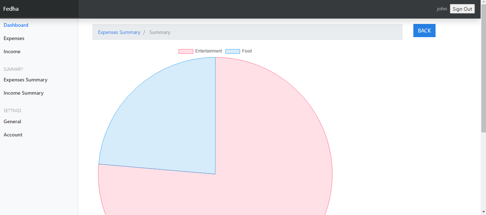

# Fedha

## Finance Tracker

Fedha is a finance tracking web application designed to help users monitor their income and expenses with ease. The app provides features for managing personal finances, visualizing income/expense data, and setting financial goals. This project is aimed at promoting financial literacy and empowering users to make informed financial decisions




## Features

- Income and Expense Tracking: Log and categorize your financial transactions.
- Dashboard: Visualize your financial data with interactive charts.
- User Authentication: Secure login and registration with email verification.
- Multi-currency Support: Track finances in different currencies.
- Custom Preferences: Set personalized financial goals and preferences.
- Expense Reports: Generate detailed reports for a selected period.
- Responsive Design: Works well on both desktop and mobile devices.

## Tech

Fedha uses a number of open source projects to work properly:

- [JavaScript, HTML, CSS] - For the frontend
- [Django](https://www.djangoproject.com/) - Python for the backend
- [PostgreSQl](https://www.postgresql.org/) - Database
- [Bootstrap](https://getbootstrap.com/docs/5.0/getting-started/introduction/) - great UI boilerplate for modern web apps
- [charts.js](https://www.chartjs.org/) - for data visualization
- [jinja2](https://jinja.palletsprojects.com/en/2.10.x/) - modern and designer-friendly templating language for Python
- [jQuery] - duh

[](https://www.djangoproject.com/)[](https://developer.mozilla.org/en-US/docs/Web/JavaScript)[](https://developer.mozilla.org/en-US/docs/Web/HTML)[](https://developer.mozilla.org/en-US/docs/Web/CSS)[](https://getbootstrap.com/)[](https://jinja.palletsprojects.com/)[](https://www.chartjs.org/)[](https://www.postgresql.org/)[](https://www.python.org/)

## Getting Started

Follow these steps to run the project locally.

## Prerequisites

- Python 3.8 or above
- Django
- Pip (Python package manager)

## Installation

Clone the repository.

```sh
https://github.com/username/fedhaexpenseapp.git
```

Navigate to the project repository

```sh
cd fedhaexpenseapp
```

Create a virtual environment and activate it:

```sh
python -m venv venv
source venv/bin/activate  # On Windows use `venv\Scripts\activate`
```

Install required dependencies...

```sh
pip install -r requirements.txt
```

Run migrations to set up the database:

```sh
python manage.py migrate
```

Start the development server

```sh
python manage.py runserver
```

Visit

```sh
http://127.0.0.1:8000  # in your browser to access the app
```

## Usage

- Register for an account or log in with an existing account.
- Navigate to the dashboard to start adding income and expense entries.
- Use the charts and reports to visualize your financial data.

## Project Structure

```sh
fedha/
│
├── authentication/               # Handles user login, registration, and password reset
├── expenses/                     # Manages expense tracking functionality
├── income/                       # Manages income tracking functionality
├── userpreferences/              # Stores and manages user settings (e.g., currency)
├── fedha/                        # Main project app with settings, URLs, and core views
├── static/                       # Static files (CSS, JS, images)
├── templates/                    # HTML templates (for all apps and custom pages)
├── currencies.json               # Currency data for user preferences
├── db.sqlite3                    # Local SQLite database
├── manage.py                     # Django management script
├── Procfile                      # Deployment instructions (e.g., for Render)
├── README.md                     # Project documentation
├── build.sh                      # Script to build, collect static files, and run migrations
├── requirements.txt              # List of Python dependencies
└── my_venv/                      # Virtual environment (should be in .gitignore)
```

## Development

Want to contribute? Great!

> Fork the repository.
> Create a new branch: git checkout -b feature-branch-name.
> Make your changes and commit them: git commit -m 'Add some feature'.
> Push to the branch: git push origin feature-branch-name.
> Open a pull request.

## License

MIT

**Free Software, Hell Yeah!**
